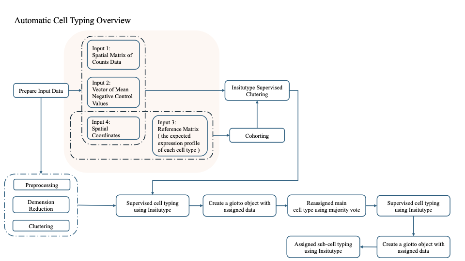

# Automatic-Cell-Typing
An automatic cell type identification pipeline for spatial transcriptomics(CosMx and Xenium). 

The motivation of developing this pipeline is using the rich gene expression information from scRNA-seq to address the issue of sub-celltype classification in spatial data.

This pipeline includes three main steps, one preprocessing and evaluation. All the things showed here can be done automatically. The workflow is demonstrated as below:

    

The input of this pipeline includes the path to the scRNA-seq reference, and the path to the spatial transcriptomics dataset. The output of this pipeline is a renewed Giotto object with two kinds of annotations: automatic-cell-typing using [Insitutype](https://github.com/Nanostring-Biostats/InSituType) and that using [Symphony](https://github.com/immunogenomics/symphony?tab=readme-ov-file). We also provided a spearman correlation matrix to make comparisons between these two methods.

## Step 0: Preprocessing

Preprocessing imports `Seurat` package to find the marker genes of spatial trnscriptomics overlapped with scRNA-seq reference, and use the [spatial-pipeline](https://github.com/CutaneousBioinf/spatial-pipeline/tree/main/Xenium) developed by our team to get the preprocessed spatial transcriptomics in the format of a Giotto object.

Users should first tell us whether the dataset they are going to analyze is CosMx or Xenium. Because the preprocessing in `spatial-pipeline` will be slightly different.

The input of this step includes the file path of scRNA-seq reference and spatial transcriptomics, and the output contains two kinds of files, a Giotto object and expression matrix. Specifically, the expression matrix for main celltypes and all sub-celltypes contained in each main celltype. 

The output marker gene files includes `global_ct_marker_expression_matrix.csv`, `subtype_T_marker_expression_filtered_matrix.csv`, `subtype_Myeloid_marker_expression_filtered_matrix.csv`, and `subtype_keratinocyte_marker_expression_matrix`

## Step 1: Majority Vote

Majority Vote involves clustering cells by celltype, calculating and normalizing the percentages of each cell type within clusters, and identifying main cell types based on cumulative percentage thresholds. Clusters needing further sub-clustering are flagged. Majority Vote applies both the thoughts from the school of probability and the school of Bayesian. If users have any prior knowledge about the celltypes, they are approved to slightly adjust the results.

The input of both CosMx and Xenium includes the file path of scRNA-seq reference and generated Giotto object after preprocessing. While for CosMx datasets, users should also tell us the path of the immunofluorescence data.
The method then updates the Giotto object with new cell type assignments and saves it, while identifying clusters that require additional sub-clustering. 
Users can find the majority vote results with 
`xenium_gobj@cell_metadata$cell$rna$cell_type_majorvote`

## Step 2: Coarse Classification

Coarse Classification aims at assigning each cell to one specific main celltype. 
For each leiden cluster that has score criteria larger than 95%, which is defined by more than one celltype in Step 1, a subset Giotto object of main celltypes included in the mixture cluster will be extracted. Then insitutypeML is applied to assign each cell to the specific main celltype. 

The output of this step is a renewed giotto object, the coarse classification results can be found with
`xenium_gobj@cell_metadata$cell$rna$cell_type_isML_updated`

## Step 3: Precise Classification

Precise Classification further classifies the cells within each main cell type and identify each sub-celltype.
Clustering results from [BASS](https://github.com/zhengli09/BASS) are used as prior info. 

In our pipeline, we only gave an example of Myeloid.Cells, but in reality users should type in the specific main celltype they are looking into and path to the corresponding scRNA-seq reference dataset.

The outputs of this step contain a renewed giotto object, and a umap plot of the whole dataset. The precise classification results can be found with `xenium_gobj@cell_metadata$cell$rna$sub_cell_type_isML_updated`

## Step 4: Symphony Mapping

[Symphony](https://github.com/immunogenomics/symphony) is an algorithm that localizes query cells within a stable low-dimensional reference embedding, facilitating reproducible downstream transfer of reference-defined annotations to the query. It projects query cell into reference embedding to assign celltype. 

We use a 2-step algorithm with Symphony in our pipeline. In the first step, it builds a reference for main celltypes and assigns main celltypes to queries. If the main celltype has multiple sub-celltypes, it will go to the second step. In the second step, it builds a reference for each main celltype and assigns sub-celltypes to queries within the main celltype.

To build a reference from scRNA-seq data and map queries, it requires 3 inputs:

1. a log(CP10K + 1) normalized gene x cell expresion matrix of scRNA-seq data

2. a metadata matrix of scRNA-seq data, containing main celltype and sub-celltype 

3. a log(CP10K + 1) normalized gene x cell expresion matrix of queries

## Evaluation

The purpose of evaluation is to verify whether this pipeline reveals informative biological insights or not. Two types of evaluation will be implemented automatically: 

1) Cell type proportions comparison between scRNA-seq reference and spatial transcriptomics
2) Marker gene identification of each sub-celltype
3) Comparison of Spearman correlation of celltype proportions between different methods.

The comparison of Spearman correlation shows as the table below:

| | Symphony in our pipeline | InsitutypeML+BASS in our pipeline | InsitutypeML |
| :----: | :----:   | :----:    | :----:   |
| Main Celltypes | 0.842 | 
| All Sub-celltypes | 0.725 |
| Keratinocytes | 0.943 |
| Myeloid | 0.349 |
| Tcells | 0.745 |

## References

Symphony

* Kang, J.B., Nathan, A., Weinand, K. et al. Efficient and precise single-cell reference atlas mapping with Symphony. Nat Commun 12, 5890 (2021). https://doi.org/10.1038/s41467-021-25957-x
